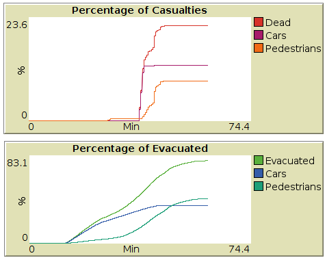

# Agent-based Evacuation Model

This repo contains an agent-based evacuation model developed in NetLogo. Although this model is calibrated for a near-field tsunami evaucation, but it has the potential to be used for any city-level evacuation scenario. This model is capable of simulating both horizontal and vertical evacuation as well as both pedestrians and vehicles, incorporating high level behavioral characteristics of the evacuees (e.g. preparation time, walking speed, driving speed, etc.). Moreover, this model can be used to study the impact of transportation network failures and road closures on evacuation times and the mortality rate of the event. 

## Getting Started

Clone this repo and open the .nlogo file with NetLogo 6.0. Do not attempt opening/translating this script to NetLogo 5. Some functionalities may be lost.

### Prerequisites

You must have NetLogo 6.0.

### Instructions

Here is a brief instruction on how to run the model to simulate a near-field tsunami evacuation scenario for the city of Seaside, OR.

1. Set the parameters on the left panel. Alternatively, you can click on *initialize* to set deafault variable to default. Here is the list and description of each variable.

* *Immediate evacuation*: If on, people start the evacuation right away. If off, they start with a delay, coming from a Rayleigh distribution. The detailed explanation is documented [here](https://ir.library.oregonstate.edu/concern/graduate_thesis_or_dissertations/bv73c493x) and [here](https://www.sciencedirect.com/science/article/pii/S0968090X15004106).

* *R(1/2/3/4)-(Ver/Hor)Evac-(Car/Foot)*: The percentages of different evacuation mode categories. These should add up to 100. Evacuees can evacuate either by foot or by car to either a horizontal or a vertical evacuation shelter. You can set the vertical evacuation percentages (R3 and R4) to zero if you do not inted to consider it.

* *Hc*: Critical inundation depth, used for estimating the number of casualties. Normally 0.5m is suggested, meaning that if a wave higher than 0.5m contacts an evacuee, they will be considered as mortalities. This parameter can relate to the resiliency of the population towards the inundation force. For other types of disasters, this logic can be modified and calibrated accordingly.

* *Ped_speed* and *ped_sigma*: The normal distribution parameters, used for random drawing of the walking speed of the evacuees. Normally walking speed ranges from 3 to 5 ft/s depending on demographic and physical characteristics of the evacuee. Setting these two variables to 4 and 0.65 respectively, conservatively simulates a population with speeds ranging from slow walking to slow running.

* *Max-speed*, *acceleration*, *deceleration*, and *alpha*: Driving and car-following model parameters. Recommend values are 35, 5, 25, and 0.14 respectively. For detailed explanation on the car-following behavior, please refer [this](https://ir.library.oregonstate.edu/concern/graduate_thesis_or_dissertations/bv73c493x) and [this](https://link.springer.com/article/10.1007/s11069-017-2927-y).

* *Rtau(1/2/3/4)* and *Rsig(1/2/3/4)*: The Rayleigh distribution parameters, governing the delay of the evacuees in each group. If set to 10 and 1.65 respectively, it means that 99% of the people evacuate within 10 to 15 minutes after the initial disaster. The detailed explanation is documented [here](https://ir.library.oregonstate.edu/concern/graduate_thesis_or_dissertations/bv73c493x).

2. Click on *READ(1/2)*

... You MUST click on this, and reload the model every time you change the parameters on the left panel. Otherwise your changes won't go into effect. This loads the transportation network, the evacuation shelters, and the hazard diffusion data.

3. Click on *Break Links* (optional)

... Use the mouse and click on the middle point of the links you wish to break. Note that this removes both directions of travel on the link. After you are done, click on the button again to turn it off. You can skip this step if you do not want to simulate network damages.

4. Click on *Place Verticals* (optional)

... Use your mouse and click on the intersections you want the vertical evacuation shelters to be placed at, and then click on the button one more time to turn it off. You can skip this step if you do not intend to model vertical evacuation. If so, please make sure that R3 and R4 percentages are set to zero.
    
5. Click on *Read(2/2)*

... This loads the population distribution and calculates the routes for the evacuees to their closest shelter, depending on their preference and decision to evacuate either horizontally or vertically.

6. *GO*
... This will run the simulation for a one-hour period. Agents walk towards the transportation netwrok, depending on their preparation/milling time and their walking speed. Afterwards, they switch colors based on their decisions. Blue for the horizontal evacuation by car, purple for vertical evacuation by car, orange for horizontal evacuation by foot, and turquoise for vertical evacuation by foot. The agents will be considered evacuated when they reach their shelter, and they will be considered as mortalities if they die due to the hazard (in this case the tsunami inundation). Refer to [this](https://ir.library.oregonstate.edu/concern/graduate_thesis_or_dissertations/bv73c493x), [this](https://link.springer.com/article/10.1007/s11069-017-2927-y), and [this](https://www.sciencedirect.com/science/article/pii/S0968090X15004106) for thorough discussion on the simulated evacuation process. 

## Snapshots

## How to use this model?

This model takes a few input in GIS and CSV format that can be easily modified for your needs.

1. *Transportation Network*: Transportation Network is read by the model from the GIS shapefiles that are in *transportation_network* directory. These shapefiles can be extracted from [OpenStreetMap.com](https://openstreetmap.com) for the city of interest. Please refer to the [this](transportation_network/README.md) for specifics of these files.

2. *Shelter Locations*: Shelter Locations are read by the model from GIS shapefiles that are in *shelter_locations* directoty. These shapefiles can be manually created as explained [here](shelter_locations/README.md) to pinpoint the intersections of the transportation network that can act as evacuation shelters.

3. *Population Distribution*: Population distribution is read by the model from GIS files located in *population_distribution* directory. These files can either be created manually or made with minimal effort with the [census](https://www.census.gov/data.html) data. Refer to [this](population_distribution/README.md) for more information.

4. *Tsunami Inundation* (optional): Or in general, Hazard diffusion data. For this specific case, and in case you wish to simulate a tsuanmi evacuation scenario, this information is read by the model from the *tsunami_inundation.csv* file that is located in *tsunami_inundation* directory. This file contains a time-series (every 30 seconds) of tsunami wave heighets for different location in the study area, in order to capture the inundation dynamics with high fidelity. Refer to [this](tsunami_inundation/README.md) for more information on how to use/adapt these for your own study area. Note that you do not have to provide any hazard data for the simulation to run. In this case, you can study the evacuation times, rather than the mortality rate, as a measurement of how quickly the study area can be evaucate and a measurement of evacuation efficiency. If you wish to do so, simply delete the *tsunami_inundation.csv* file in *tsunami_inundation* directory.

## What can I learn from this model?

There are a few directions that you can study with this model. The two main output of this model are (I) Evaucation Time Distribution and (II) Mortality Rate (Figures below) in case that the hazard information is provided. With these two outputs you can analyze,

1. Impacts of underlying parameters (e.g., evacuation mode choice, milling time, walking and driving speed, etc.) on the evaucation mortality rate or evacuation times, in order to see how and to what extent these variables change the mortality rate or the evaucation times.

2. Impacts of vertical evaucation behavior on the evaucation times and mortality rate

3. Impacts of link failure and road closure on evaucation

...

## Funding and Support

This project is partially supported by [Oregon Sea Grant](http://seagrant.oregonstate.edu/) and National Science Foundation [Award \#1563618](https://www.nsf.gov/awardsearch/showAward?AWD_ID=1563618), [\#1826407](https://www.nsf.gov/awardsearch/showAward?AWD_ID=1826407), and [\#1902888](https://www.nsf.gov/awardsearch/showAward?AWD_ID=1902888). This model has been developed under direct supervision of [Dr. Haizhong Wang](http://cce.oregonstate.edu/wang), [Dr. Dan Cox](http://cce.oregonstate.edu/cox), and [Dr. Lori A. Cramer](https://liberalarts.oregonstate.edu/spp/sociology/lori-cramer) at [Oregon State University](http://oregonstate.edu).

## Publications

You can use, modify, adapt this model to your own needs. If you use this model to any extent, we ask you to cite our relevent publications:

+ Wang, H., Mostafizi, A., Cramer, L. A., Cox, D., & Park, H. (2016). An agent-based model of a multimodal near-field tsunami evacuation: decision-making and life safety. Transportation Research Part C: Emerging Technologies, 64, 86-100.

+ Mostafizi, A. (2016). Agent-based tsunami evacuation model: life safety and network resilience.

+ Mostafizi, A., Wang, H., Cox, D., Cramer, L. A., & Dong, S. (2017). Agent-based tsunami evacuation modeling of unplanned network disruptions for evidence-driven resource allocation and retrofitting strategies. Natural Hazards, 88(3), 1347-1372.

+ Mostafizi, Alireza, et al. "An agent-based vertical evacuation model for a near-field tsunami: Choice behavior, logical shelter locations, and life safety." International journal of disaster risk reduction 34 (2019): 467-479.

+ Mostafizi, Alireza, et al. An Agent-Based Model of Vertical Tsunami Evacuation Behavior and Shelter Locations: A Multi-Criteria Decision-Making Problem. No. 18-06293. 2018.

## Authors

* **Alireza Mostafizi** - [armostafizi](https://github.com/armostafizi) / [alire.me](https://alire.me)
